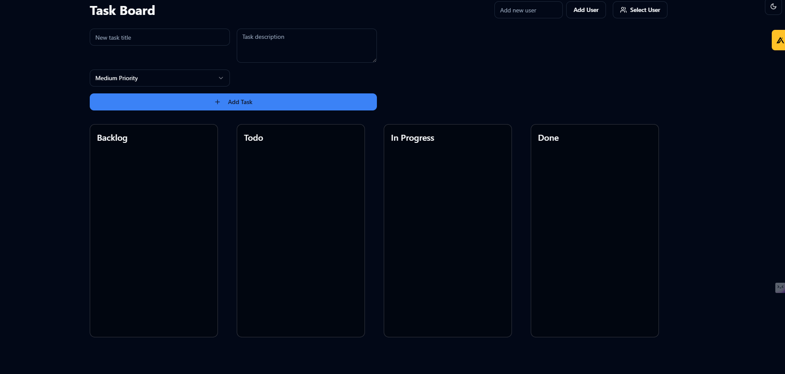

# Task Board

Welcome to the Task Board project! This application is a dynamic and intuitive Kanban-style task management tool designed to help users visualize workflows, manage tasks, and improve productivity. It serves as an engaging platform to explore my skills and technical expertise in modern web development.

## 🔗 Live Demo

[Visit Project Website](https://task-board.kollaprakyath.dev/)

---

## 📂 Project Structure

The Task Board application is a single-page application (SPA) built with modern web technologies for a seamless user experience. Here's an overview:

- **Task Management Section:** Allows users to create, update, and delete tasks with drag-and-drop functionality for workflow visualization.
- **Customizable Boards:** Enables users to manage multiple boards with unique tasks and labels.
- **Dark Mode:** A toggleable dark mode feature for a personalized user experience.

---

## 🛠️ Technologies Used
This project leverages the following tools and frameworks:

- **Frontend:**
  - Vite
  - TypeScript
  - React
  - shadcn-ui
  - Tailwind CSS
  - React Query (@tanstack/react-query)
  - React Router DOM
  - Lucide React (for icons)

- **Development Tools:**
  - Node.js
  - npm (Node Package Manager)

---

## Features

- **Task Board**: Organize tasks across different stages (Backlog, Todo, In Progress, Done)
- **Task Management**: 
  - Create tasks with title and description
  - Set task priorities (Low, Medium, High)
  - Move tasks between columns
  - Edit task details
- **User Management**:
  - Add multiple users
  - Switch between user dashboards
  - User-specific task views
- **Responsive Design**:
  - Works on mobile and desktop
  - Adaptive layout for different screen sizes
- **Dark Mode**: Toggle between light and dark themes



---

**Getting Started**

The only requirement is having Node.js & npm installed - [install with nvm](https://github.com/nvm-sh/nvm#installing-and-updating)

Follow these steps:

```sh
# Step 1: Clone the repository using the project's Git URL.
git clone <YOUR_GIT_URL>

# Step 2: Navigate to the project directory.
cd <YOUR_PROJECT_NAME>

# Step 3: Install the necessary dependencies.
npm i

# Step 4: Start the development server with auto-reloading and an instant preview.
npm run dev
```
---

## License

This project is licensed under the MIT License - see the [LICENSE](LICENSE) file for details.

